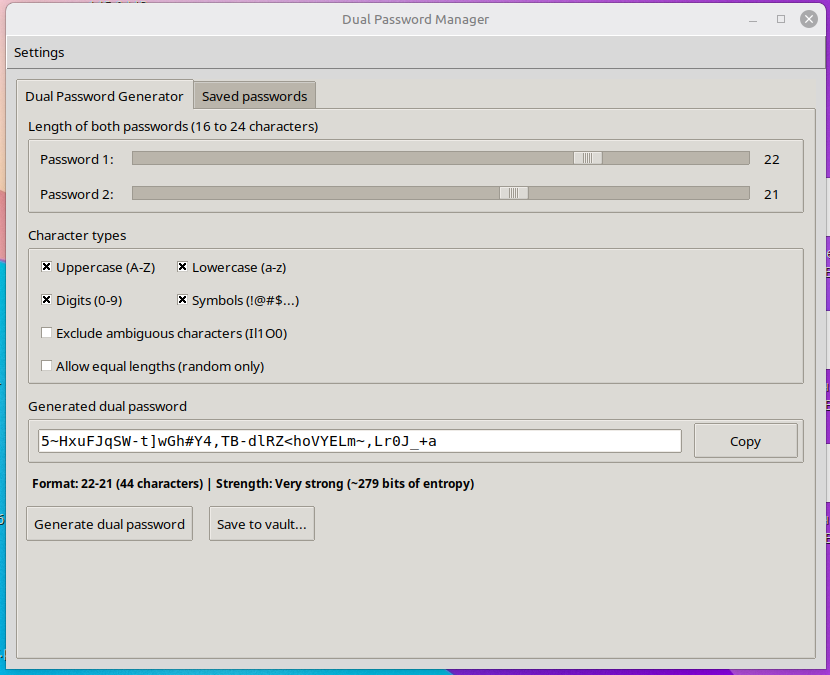
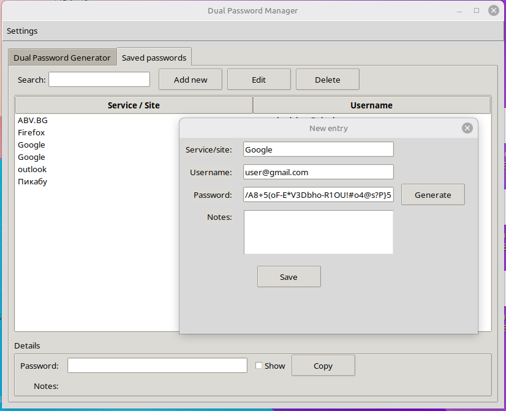

# Dual Password Manager

[](https://www.python.org/)
[](LICENSE)
[](https://www.linuxmint.com/)
[](https://www.linuxmint.com/)
[](https://docs.python.org/3/library/tkinter.html)
[](https://cryptography.io/)
[](#security-model)
[](#security-model)
[](#features)
[](https://www.python.org/)
[](https://www.python.org/)
[](https://makeapullrequest.com)
[](#)

Desktop GUI for generating one strong password composed of two complex random passwords joined by a hyphen. The two halves are kept at different lengths so the hyphen does not sit in the middle and the left-right pattern is harder to notice. The login secret is the full string; sites verify that whole value, not the two halves on their own. Built for Linux Mint with Python 3, Tkinter, and the `cryptography` library. No accounts, no cloud, no telemetry.

The UI is in **English**. The vault file stays next to the script.

---

## Features

- Dual password generator: two independent secrets joined as `PASSWORD1-PASSWORD2`
- Length sliders from 16 to 24 characters per half
- Character-set toggles: upper, lower, digits, symbols
- Optional exclusion of ambiguous characters (`Il1O0`)
- Optional ban on equal lengths (second length is randomized when needed)
- Entropy estimate and strength label for the combined password
- Encrypted local vault (`password_vault.enc`)
- Master-password unlock / first-run vault creation
- Change master password from the Settings menu
- Search, add, edit, and delete vault entries
- Multiple accounts per service
- Show / hide stored password
- Clipboard copy with automatic wipe after 30 seconds
- Atomic vault writes and `0600` file permissions

Generator tab after a password has been created with the chosen settings:



---

## Security model

| Layer | Implementation |
| --- | --- |
| Encryption | Fernet (AES-128-CBC + HMAC-SHA256) from the `cryptography` package |
| Key derivation | `hashlib.scrypt` with a random 16-byte salt |
| KDF calibration | First vault creation targets ~1 second of work, capped at `N = 2^20` or ~512 MB RAM |
| Vault format | `salt (16) + n_pow + r + p + Fernet token` |
| Persistence | Atomic write via `.tmp` then replace |
| File mode | `chmod 600` on the vault |
| Clipboard | Auto-clear after 30 seconds |
| Network | None. Everything is local |

**There is no password recovery.** If the master password is lost, the vault cannot be decrypted.

A dual password built from the full character set (upper, lower, digits, symbols) has about **260–310 bits** of entropy, depending on the two lengths (for example 18+23 characters is ~266 bits; 24+24 is ~311 bits). That is far above the ~128-bit threshold used for modern symmetric keys. Checking even a tiny fraction of a 2^260 search space is not feasible with any known supercomputer, so brute-forcing such a generated password is not a realistic attack. Vault confidentiality still depends on a strong master password, because an attacker who has `password_vault.enc` attacks the scrypt-derived key, not the stored secrets directly.

This project has **not** had an independent security audit, formal penetration tests, an external cryptography review, or a published process for handling vulnerability reports. Keep that absence in mind. The cryptographic design itself is not a toy; this is only a reminder that the program is not an independently audited, official product. The source is open, so the encryption path can be read end to end: there is no hidden network call and no concealed backdoor in the code that is published.

---

## Requirements

| Component | Why it is needed | How it is provided |
| --- | --- | --- |
| Python 3.8+ | Runtime (pathlib, f-strings, type hints, `hashlib.scrypt`) | System package |
| Tkinter (`python3-tk`) | GUI toolkit used by the app | APT on Debian/Ubuntu/Mint |
| `cryptography` | Fernet encrypt / decrypt | pip inside a virtualenv |
| Standard library | `os`, `json`, `hashlib`, `secrets`, `base64`, `math`, `pathlib` | Bundled with Python |

No other third-party packages are required.

---

## Install on Linux Mint

Linux Mint 21.x ships Python 3.10. Linux Mint 22.x ships Python 3.12 and **blocks system-wide pip installs** (PEP 668 / externally managed environment). Use a virtual environment on both releases.

### 1. System packages

```bash
sudo apt update
sudo apt install python3 python3-pip python3-venv python3-tk
```

- `python3-tk` provides Tkinter. Without it the app fails at `import tkinter`.
- `python3-venv` is required to create an isolated environment.

Check Tkinter:

```bash
python3 -c "import tkinter; print('Tkinter OK')"
```

### 2. Project folder and virtualenv (recommended)

```bash
mkdir -p ~/apps/dual-password-manager
cd ~/apps/dual-password-manager

# put password_manager_gui.py in this folder

python3 -m venv .venv
source .venv/bin/activate
python -m pip install --upgrade pip
pip install cryptography
```

Optional `requirements.txt`:

```text
cryptography>=42.0.0
```

Then:

```bash
pip install -r requirements.txt
```

### 3. Quick install without venv (Mint 21 only)

On Mint 22 this usually fails with `externally-managed-environment`. Prefer the venv path above.

```bash
sudo apt install python3-tk python3-pip
pip install --user cryptography
```

If `pip install cryptography` tries to compile from source and fails, install build headers and retry inside the venv:

```bash
sudo apt install python3-dev build-essential libssl-dev libffi-dev
pip install cryptography
```

On current Mint versions a binary wheel is normally available and no compiler is needed.

### 4. Download the two programs

From this repository download both scripts into the same folder (the vault file will be created next to them):

- `password_manager.py` — **terminal only**. Open a terminal in that folder and run it there. It has no window.
- `password_manager_gui.py` — **graphical app**. In the file manager double-click it and choose **Run** (or **Run in Terminal**). A window opens.

They are companions: same vault format, same `password_vault.enc` if they live in the same directory.

The whole kit is portable. Copy `password_manager.py`, `password_manager_gui.py`, and `password_vault.enc` together onto a USB stick or another computer and keep them in one folder. The vault path is always “next to the script”, so nothing is registered in the system. On the other machine you still need Python 3, Tkinter (`python3-tk` for the GUI), and `cryptography`. Unlock with the same master password. Do not split the three files across different folders.

### 5. Mark both files as executable

Linux will not launch a `.py` file as a program until the execute bit is set.

**With the mouse (Linux Mint / Nemo):**

1. Right-click `password_manager.py` → **Properties**.
2. Open the **Permissions** tab.
3. Under **Execute**, enable execute for the owner — on Mint that is the **Allow executing file as program** checkbox. If you see separate Owner / Group / Others execute boxes, tick **all Execute** checkboxes.
4. Repeat the same for `password_manager_gui.py`.

**From a terminal** (same result):

```bash
chmod +x password_manager.py password_manager_gui.py
```

### 6. How to start each program

**GUI** (`password_manager_gui.py`):

- File manager: double-click → **Run**.
- Or in a terminal (activate the venv first if you created one):

```bash
source .venv/bin/activate
python3 password_manager_gui.py
```

**Console** (`password_manager.py`) — this one only works in a terminal. Double-clicking it is the wrong way to use it:

```bash
source .venv/bin/activate   # if you created a venv
python3 password_manager.py
```

First launch asks you to create a master password and writes `password_vault.enc` next to the scripts.

---

## Usage

1. Launch the app and unlock (or create) the vault.
2. **Generator** tab: pick lengths and character types, then **Generate dual password**.
3. Copy the result (clipboard clears after 30 seconds) or save it into the vault.
4. **Saved passwords** tab: search, add, edit, or delete entries.

   New-entry dialog (service, username, password, notes):

   

5. **Settings → Change master password** re-encrypts the vault with a new key.

Do not commit `password_vault.enc` or `.tmp` files to git.

Suggested `.gitignore`:

```gitignore
.venv/
__pycache__/
password_vault.enc
password_vault.tmp
*.enc
```

---

## Project layout

```text
.
├── password_manager_gui.py   # GUI application
├── password_manager.py       # console companion
├── passwords.png             # screenshot: generator with a created password
├── add_new.png               # screenshot: new vault entry dialog
├── password_vault.enc        # created at runtime — keep private
├── requirements.txt          # optional: cryptography
└── README.md
```

---

## How the generator works

Each half of the dual password is built so that every selected character class appears at least once. The remaining characters are drawn from the full pool with `secrets`. The list is shuffled with Fisher–Yates using `secrets.randbelow`.

Default format example:

```text
aB3$kLm9pQ...-Xy7!nOp2...
```

Entropy is estimated as `total_length * log2(pool_size)` and mapped to a strength label.

---

## Disclaimer

- Keep backups of `password_vault.enc` in a safe place.
- Choose a strong, unique master password. The vault is only as strong as that password.
- The application UI is in English.
- Review the code before storing real credentials.
- Lost master password = lost vault. There is no backdoor.

---

## License

Released under the MIT License. Add a `LICENSE` file in the repository root if you publish this project.
